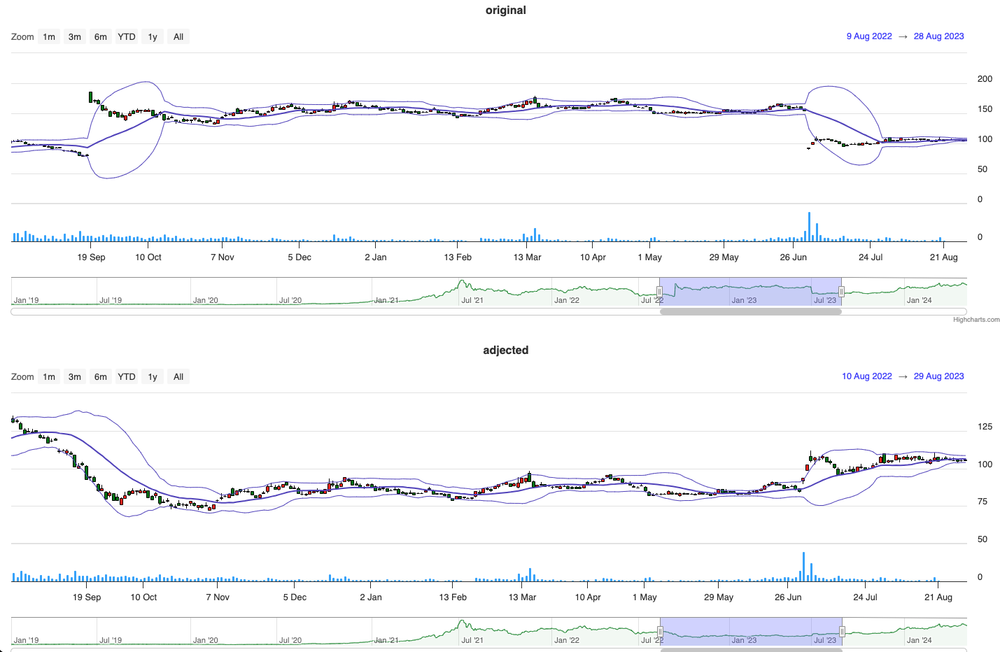

# 還原股價實戰：計算歷史價格，破解股市跳空迷思

在投資股市時，擁有穩健的交易策略無疑是致勝關鍵。可惜的是，原始股價走勢圖常因公司的除權息、減資等財務操作，而出現不連續的跳空缺口，使技術分析指標嚴重失真。例如移動平均線的計算就會受到影響，難以準確反映實際的價格變動趨勢。

有鑑於此，我們必須從頭開始計算出真實的"還原股價"，將這些非交易因素的干擾剔除，才能還原股票的實際成本變化，讓交易策略無往不利。那麼該如何正確計算還原股價呢？

本文將為你一步步解析運算流程，只要掌握了除權息、減資、變更面額等關鍵資訊的獲取管道，並對應使用適當的調整公式，就能夠透過程式化的方式，自動化還原各檔個股的歷史價格紀錄，為技術分析鋪平道路。

無論你是資深的程式交易高手，還是投資新手，了解還原股價的概念與作法，都將助你一臂之力，讓策略分析洞見力大增，投資獲利無往不利！

## 前言

股價走勢，一般來說造成日線跟還原差異較大的因素通常有以下三種：

1. 除權息
2. 減資
3. 變更面額

舉例來說，假設某股配發現金股利 5 元，除息會使得股價直接下降 5 元，若不使用還原股價走勢圖，原始股價走勢圖將出現不連續的跳空缺口。對不了解除權息情況的投資人而言，恐將造成股價下跌的誤解。還原的目的就是使得這種非交易因素消失，該段時間持有者的成本也不會失真，影響移動平均線等技術指標的準確性。

## 範圍說明

本範例專案目前僅支援對上市股票的除權息、減資等情況進行還原股價的計算，未來將持續擴充支援上櫃股票。

## 計算步驟

1. 取得 **除權息** 資料，並計算縮放比
   資料來源：[TWSE 除權除息計算結果表](https://wwwc.twse.com.tw/zh/announcement/ex-right/twt49u.html)

- 計算 `股息乘數` = 1 - `每股配發現金股利` / `除權息前收盤價`
- 計算 `股利乘數` = 1 / (1 + `按普通股股東持股比例每千股無償配股` / 1000)

下表以 2023 年 **長榮(2603)** 舉例：

| 日期 | 收盤價 | 調整計算                            | 調整後收盤價 |
| ---- | ------ | ----------------------------------- | ------------ |
| 7/3  | 102.5  | 最新收盤價不調整為基準              | 102.5        |
| 6/30 | 93.5   | 除息乘數計算: 1 - 70 / 155 = 0.5483 | 93.5         |
| 6/29 | 155    | 155 \* 0.5483                       | 84.98        |
| 6/28 | 157.5  | 157.5 \* 0.5483                     | 86.35        |
| 6/27 | 161    | 161 \* 0.5483                       | 88.27        |

下表以 2023 年 **玉山金(2884)** 舉例：

| 日期 | 收盤價 | 調整計算                                                                                  | 調整後收盤價 |
| ---- | ------ | ----------------------------------------------------------------------------------------- | ------------ |
| 7/28 | 25.95  | 最新收盤價不調整為基準                                                                    | 25.95        |
| 7/27 | 26     | 除息乘數計算: 1 - 0.189386 / 26.95 = 0.9929, 除權乘數計算: 1 / (1 + 37.9 / 1000) = 0.9634 | 26           |
| 6/26 | 26.95  | 26.95 \* 0.9929 \* 0.9634                                                                 | 25.78        |
| 6/25 | 26.55  | 26.55 \* 0.9929 \* 0.9634                                                                 | 25.40        |
| 6/24 | 26.25  | 26.25 \* 0.9929 \* 0.9634                                                                 | 25.11        |

2. 取得 **減資** 資料，並計算縮放比
   資料來源：[TWSE 股票減資恢復買賣參考價格](https://www.twse.com.tw/zh/announcement/reduction/twtauu.html)

- 計算 `減資乘數` = 1 - (`停止買賣前收盤價格` - `恢復買賣參考價`) / `停止買賣前收盤價格`

3. 取得 **變更面額** 資料，並計算縮放比
   資料來源：[TWSE 變更股票面額恢復買賣參考價格](https://www.twse.com.tw/pcversion/zh/page/trading/exchange/TWTB8U.html)

- 計算 `變更面額乘數` = 1 - (`停止買賣前收盤價格` - `恢復買賣參考價`) / `停止買賣前收盤價格`

4. 接下來透過 Fugle API 獲取原始行情股價走勢圖資料
   資料來源：[Fugle API 文檔](https://developer.fugle.tw/docs/data/http-api/historical/candles)

5. 最後將日期小於 **除權息**、**減資**、**變更面額** 的股價資料乘上 **乘數** 後即可得到調整後的 **還原股價**。

## 結論

還原股價對程式交易有著重要的幫助，主要表現在以下幾個方面：

1. **更準確的技術分析**：使用還原股價可以消除因除權息、減資或變更面額等因素而導致的價格異常，使得技術分析更加準確。例如，在計算移動平均線時，如果不還原股價，可能會因為價格的跳空而導致計算結果不準確。

2. **更合理的交易策略**：基於還原股價的技術分析可以幫助交易者制定更合理的交易策略，更好地把握股票價格的波動情況，進而提高交易的勝率和盈利能力。

3. **更準確的風險控制**：還原股價可以幫助交易者更準確地評估風險，避免因為未考慮到價格調整因素而導致的風險判斷錯誤。

總的來說，還原股價可以幫助程式交易者更好地理解和分析股票價格走勢，制定更有效的交易策略，提高交易的成功率和盈利能力。

最後附上 **長榮(2603)** 調整後與未調整股價走勢圖，並加上 **布林通道指標** 可以明顯看到，整體股價曲線的波動較為平緩，更能反映實際的價格變動情況。



## 開始使用

- 安裝依賴套件

```bash
npm install
```

### backend 環境變數設定

- 於 `apps/backend/.env` 放上 Fugle 行情 API Key

```env
TZ="Asia/Taipei"
FUGLE_API_KEY=""
```

### 啟動程式

```
npx nx run-many --target=serve --projects=backend,frontend
```

接下來就可以使用 http://localhost:4200 看到對照圖的樣子囉～

## 專案結構

1. `backend/src/twse-scraper.service.ts` 爬取 **除權息**、**減資**、**變更面額** 資訊。
2. `backend/src/fugle-api.service.ts` 透過 Fugle API 獲取股價走勢圖資訊。
3. `backend/src/aggregator.service.ts`
   - getAdjustedRates: 將 **除權息**、**減資**、**變更面額** 轉換成縮放比。
   - getAdjustedCandles: 將 candles OHLC 進行全面調整計算。
4. `backend/src/app.controller.ts` 使用 RESTful API 讓其他介面可以存取。
5. `frontend/**` React 前端簡單 DEMO 介面，使用 [highcharts stock](https://www.highcharts.com/docs/stock/getting-started-stock) 作為線圖渲染套件。
